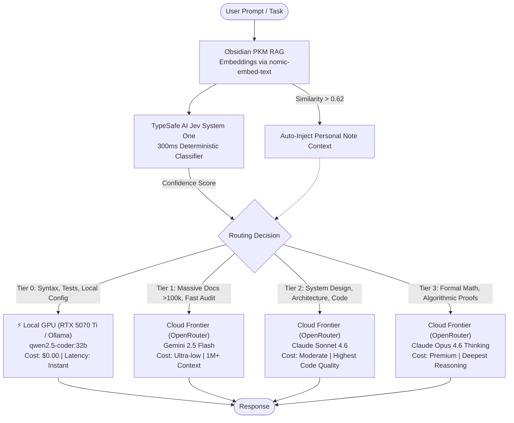

# Jev Gateway: Intelligent Hybrid AI Model Router & PKM RAG

[](LICENSE)
[]()
[]()
[]()
[]()

> **Sub-300ms deterministic LLM routing between $0.00 local GPUs, Obsidian personal knowledge graphs, and frontier cloud models (Claude & Gemini).**

---

## 💡 Why This Exists

Developers face a constant dilemma when building with AI:
1. **Cloud Frontier APIs (Claude 3.7 / Gemini Pro)** are brilliant for system architecture and deep reasoning, but burn money on trivial syntax lookups and bash scripts.
2. **Local Models (Qwen 2.5 Coder 32B on consumer GPUs)** are 100% free, private, and fast, but run out of VRAM or reasoning capacity on massive context audits or complex distributed system designs.
3. **Amnesiac Models**: Neither know your private personal configurations, dotfiles, or internal codebase notes unless manually pasted into every prompt.

**Jev Gateway** solves this by unifying **TypeSafe AI's System One (Jev)**, local **Obsidian Vault RAG**, a dedicated **local GPU (e.g. RTX 5070 Ti)**, and **OpenRouter** into a unified, autonomous pipeline.

---

## 🏛️ Architecture



---

## ⚡ Tiering Matrix

| Tier | Target Destination | Provider | Best For | Cost |
| :--- | :--- | :--- | :--- | :--- |
| **Tier 0** | `qwen2.5-coder:32b` | Local Ollama (e.g. RTX 5070 Ti / Tailscale) | Syntax, unit tests, scripts, local system configs | **$0.00** |
| **Tier 1** | `google/gemini-2.5-flash` | OpenRouter | Massive dumps ($>50\text{k}$ tokens), doc analysis, multimodal | < $0.001 |
| **Tier 2** | `anthropic/claude-sonnet-4.6` | OpenRouter | Architecture, complex refactoring, full-stack code | Standard |
| **Tier 3** | `anthropic/claude-opus-4.6` | OpenRouter | Math proofs, formal verification, hard research logic | Premium |

---

## 🚀 Live Benchmark Examples

All routing decisions are verified live using TypeSafe Jev (`jev-latest`):

| User Query | Chosen Destination | Confidence | Jev Latency | Notes Auto-Injected |
| :--- | :--- | :--- | :--- | :--- |
| `"Write a 1-liner bash command to check listening ports with ss"` | **Local 5070 Ti (`qwen 32b`)** | 100% | 595 ms | *None* |
| `"how do I configure my ASUS keyboard backlight"` | **Local 5070 Ti (`qwen 32b`)** | 100% | 526 ms | `ASUS-Backlight-Settings.md` |
| `"In 1 concise sentence, explain what CAP theorem states"` | **Claude Sonnet 4.6 (OpenRouter)** | 61% | 308 ms | *None* |
| `"Design an enterprise multi-region event-driven lakehouse architecture"` | **Claude Sonnet 4.6 (OpenRouter)** | 97% | 302 ms | `pyspark-lakehouse-mastery.md` |
| `"400-page regulatory compliance PDF and codebase dump"` | **Gemini 2.5 Flash (OpenRouter)** | 100% | 290 ms | *None* |

---

## 🛠️ Installation & Setup

### 1. Clone the Repository
```bash
git clone https://github.com/dragpk247/jev-gateway.git
cd jev-gateway
```

### 2. Set Up Python Environment
```bash
python3 -m venv venv
source venv/bin/activate
pip install -r requirements.txt
```

### 3. Configure API Keys
Export your credentials or create a `.env` file:
```bash
export JEV_API_KEY="your_typesafe_jev_api_key"
export OPENROUTER_API_KEY="your_openrouter_api_key"
export OLLAMA_HOST="http://localhost:11434" # or Tailscale IP of your GPU desktop
```

### 4. Index Your Local Knowledge Base (Obsidian)
Point `VAULT_DIR` in `config.py` to your notes folder:
```bash
python3 -m jev_gateway.indexer --index
```

---

## 💻 Usage

### 1. CLI Query (Auto-Route & Execute)
```bash
python3 -m jev_gateway.executor --exec "How do I optimize Kafka consumer rebalance lag?"
```

### 2. Dry-Run / Routing Inspection
```bash
python3 -m jev_gateway.executor "Write a regex to match IPv6 addresses"
```

### 3. Drop-in OpenAI API Gateway Mode
Launch the local proxy server:
```bash
python3 -m jev_gateway.server --port 8000
```
Then configure **Aider**, **Cursor**, or **Continue.dev** to point to `http://localhost:8000/v1`:
```bash
aider --openai-api-base http://localhost:8000/v1 --model custom
```

---

## 📊 Comparison with Existing Approaches

| Feature | RouteLLM | OpenStudio | VaultChat | **Jev Gateway** |
| :--- | :---: | :---: | :---: | :---: |
| **Deterministic Classifier (Sub-300ms)** | ❌ | ❌ | ❌ | **✅ (Jev System One)** |
| **$0.00 Local Consumer GPU Offloading** | ❌ | ⚠️ (Manual tags) | ⚠️ (Static toggle) | **✅ (Autonomous)** |
| **PKM Knowledge Injection (Obsidian)** | ❌ | ❌ | ✅ | **✅ (Pre-flight RAG)** |
| **Multi-Tier Frontier Cloud Fallback** | ⚠️ (1 Model) | ✅ | ❌ | **✅ (Sonnet/Opus/Gemini)** |
| **Zero Heavy GPU Classifier Overhead** | ⚠️ | ❌ | ❌ | **✅** |

---

## 📄 License
MIT License. Created by [dragpk247](https://github.com/dragpk247).


---

## 🔮 Strategic Evolution: How to Make `jev-gateway` Exceptional

### 1. Unique Architectural Moats
1. **Zero-Leak Privacy Sandbox**: Jev evaluates queries for sensitive filepaths, credentials, and confidential tags. Matches are hard-bound to the local RTX 5070 Ti.
2. **Speculative Execution with Test Escalation**:
   - Routine code is drafted locally by Qwen 32B for **$0.00**.
   - A local test runner (`pytest` / `ruff`) verifies the output.
   - **Only on test failure** does the gateway escalate the error trace to Claude Sonnet, saving up to 85% in API bills.
3. **Bi-Directional PKM Learning (Obsidian Write-Back)**:
   - When Claude or Gemini synthesizes a novel architecture or complex debug resolution, `jev-gateway` automatically writes a condensed reference note back to the Obsidian Vault.
   - On future queries, local Qwen 32B leverages that synthesized note via RAG for **$0.00**, making the local GPU system progressively smarter over time.
4. **Sub-50ms FastPath Caching**: Hash semantic query embeddings to short-circuit repeated questions locally in <1ms without network round-trips.

---

## ⚖️ Provider Evaluation: Alternatives to OpenRouter

| Provider Architecture | Primary Advantages | Best Use Case | Trade-offs |
| :--- | :--- | :--- | :--- |
| **Direct APIs** (Anthropic & Google AI Studio) | **Native Prompt Caching** (90% cheaper on repeat context), lowest network latency, generous free tier on Gemini. | Primary production driver for Claude 3.7 & Gemini 2.5 Flash. | Managing individual provider API keys. |
| **Serverless Open-Weights** (DeepInfra, Together AI, RunPod) | Uncapped throughput (120+ tokens/sec) for massive open models (DeepSeek-R1 671B, Qwen 72B). 50–70% cheaper than proprietary. | Heavy open-source batch workloads beyond local 16GB VRAM. | Lacks proprietary reasoning benchmarks. |
| **Cloudflare AI Gateway** | Edge semantic caching (5ms repeat hits for $0.00), automatic multi-provider failover, zero markup. | Unified proxy layer ahead of direct Anthropic/Google endpoints. | Requires Cloudflare account setup. |
| **OpenRouter** (Current) | Instant access to 200+ models with a single balance and unified credit line. | Rapid prototyping, exploratory model benchmarking. | Proxy latency overhead, shared rate pools. |

---

### The Recommended Tri-Engine Production Stack
```
                              ┌── Tier 0 ($0.00) ──► Local RTX 5070 Ti (Qwen 32B via Ollama)
User Prompt ──► [ JEV GATEWAY ] ├── Tier 1 (Free/Fast) ► Google AI Studio Direct (Gemini 2.5 Flash)
                              └── Tier 2 (Frontier) ─► Anthropic Direct / Cloudflare (Claude 3.7 Sonnet)
```
